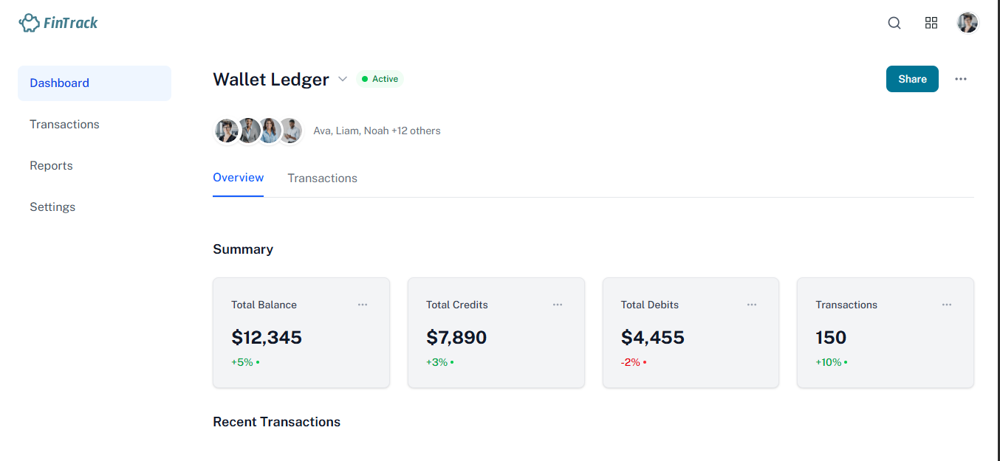

A modern financial dashboard built with Next.js, TypeScript, and Tailwind CSS that displays wallet transactions and financial summaries.



## Features

- **Dashboard Overview**
  - Summary cards for total balance, credits, debits, and transaction count
  - Percentage change indicators
  - User avatars section
- **Transaction Management**
  - Sortable transaction table by date
  - Color-coded transaction types (credit/debit)
  - Responsive design for all screen sizes
- **UI Components**
  - Custom navigation header with search
  - Tab-based navigation
  - Interactive elements with hover states
  - Modern icons from Lucide

## Technologies Used

- Next.js 15.4.5 (App Router)
- React 19.1.0
- TypeScript 5
- Tailwind CSS 4
- Lucide React 0.536.0 (for icons)
- clsx 2.1.1 (for conditional class names)


## Getting Started

First, run the development server:

```bash
npm run dev
# or
yarn dev
# or
pnpm dev
# or
bun dev
```

Open [http://localhost:3000](http://localhost:3000) with your browser to see the result.

You can start editing the page by modifying `app/page.tsx`. The page auto-updates as you edit the file.

This project uses [`next/font`](https://nextjs.org/docs/app/building-your-application/optimizing/fonts) to automatically optimize and load [Geist](https://vercel.com/font), a new font family for Vercel.

## Learn More

To learn more about Next.js, take a look at the following resources:

- [Next.js Documentation](https://nextjs.org/docs) - learn about Next.js features and API.
- [Learn Next.js](https://nextjs.org/learn) - an interactive Next.js tutorial.

You can check out [the Next.js GitHub repository](https://github.com/vercel/next.js) - your feedback and contributions are welcome!

## Deploy on Vercel

The easiest way to deploy your Next.js app is to use the [Vercel Platform](https://vercel.com/new?utm_medium=default-template&filter=next.js&utm_source=create-next-app&utm_campaign=create-next-app-readme) from the creators of Next.js.

Check out our [Next.js deployment documentation](https://nextjs.org/docs/app/building-your-application/deploying) for more details.
